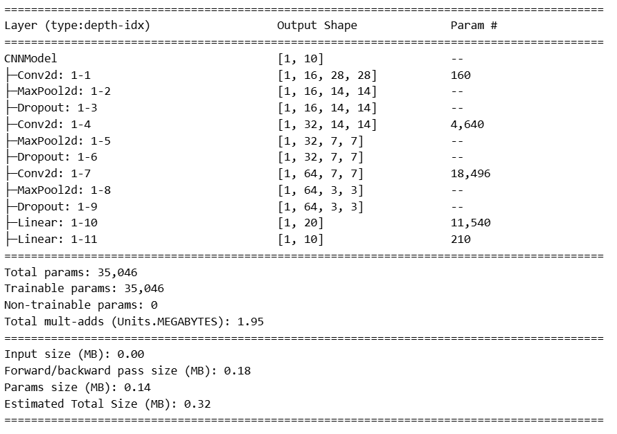
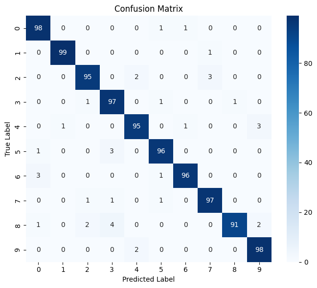
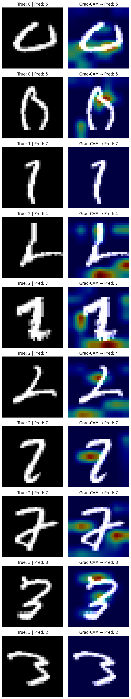

# Digit Classification with Explainable AI (XAI)

A PyTorch-based CNN model for handwritten digit classification with integrated Explainability (Grad-CAM).

---

## Overview

This project implements a Convolutional Neural Network (CNN) for grayscale digit classification (28×28 images).
It follows a clean and modular design suitable for research, teaching, and reproducibility.
In addition to classification, it integrates explainable AI techniques (Grad-CAM) to visualize model reasoning and highlight the regions influencing predictions.

---

## 📁 Project Structure

<pre><code>
Digit_Classification_XAI/
│
├── config/
│   └── config.yaml              # Hyperparameters and training configuration
│
├── data/
│   ├── train/                   # Training images organized by class
│   └── test/                    # Test images organized by class
│
├── src/
│   ├── main.py                  # Entry point for training and evaluation
│   ├── models/
│   │   └── cnn_model.py         # CNN model definition
│   ├── utils/
│   │   ├── dataset.py           # Data loading and augmentation
│   │   ├── train_eval.py        # Training and evaluation utilities
│   │   └── explain.py           # Grad-CAM and visualization methods
│
├── notebooks/
│   └── EDA_and_Explainability.ipynb   # Exploratory analysis and XAI demonstrations
│
├── checkpoints/                 # Saved model weights
├── README.md
└── requirements.txt
</code></pre>


---

## Model Architecture


---

## Evaluation Results

**Confusion Matrix**



**Classification Report (Macro Averages)**

| Metric      | Score   |
|--------------|---------:|
| **Accuracy** | 0.9600  |
| **Precision**| 0.9607  |
| **Recall**   | 0.9600  |
| **F1-Score** | 0.9598  |

---

## Explainability (Grad-CAM)

Grad-CAM visualizations show where the CNN focuses when making predictions.
Misclassified samples are analyzed to understand model bias or confusion.


---

## How to Run

### 1. Clone the repository
```bash
git clone https://github.com/<your_username>/Digit_Classification_XAI.git
cd Digit_Classification_XAI
```

### 2. Create environment
```bash
conda create -n pytorch_gpu python=3.10
conda activate pytorch_gpu
pip install -r requirements.txt
```

### 3. Train the model
```bash
python -m src.main
```

### 4. Explore explainability in Jupyter
```bash
jupyter notebook notebooks/EDA_and_Explainability.ipynb
```

#### Key Features:
- Modular PyTorch training pipeline
- Config-driven architecture
- Integrated Grad-CAM explainability
- Deterministic and reproducible results
- Compatible with CPU and GPU

---

## 📫 Contact

**Rasoul Ameri**  
📧 [rasoulameri@gmail.com](mailto:rasoulameri90@gmail.com)  
🔗 [GitHub Profile](https://github.com/rasoulameri)

---


